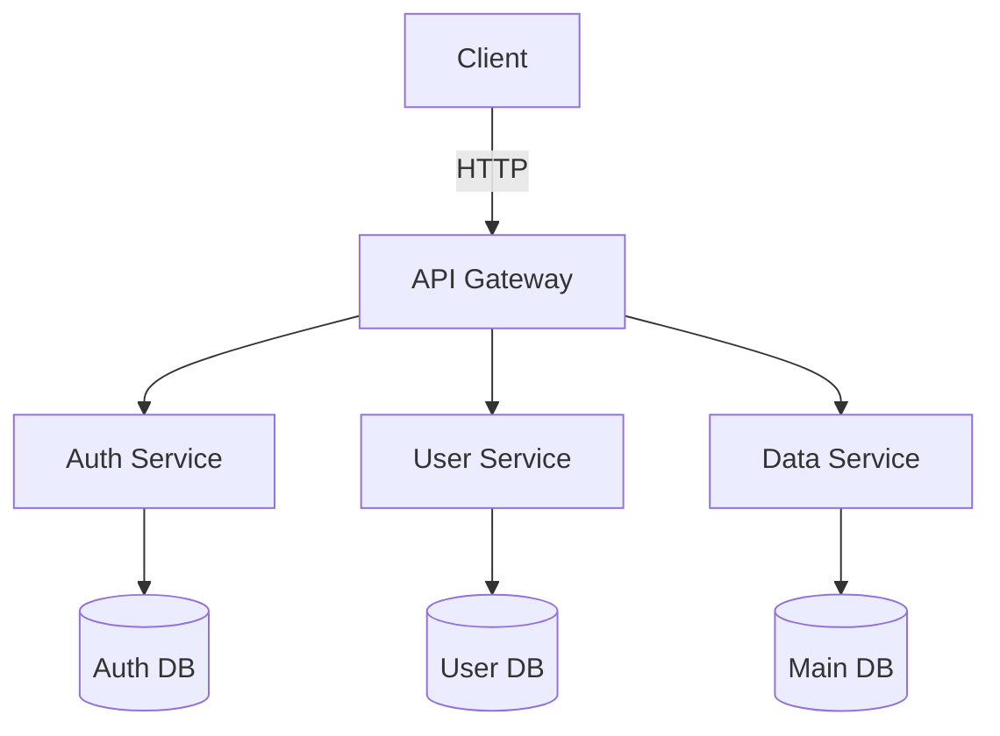

# Documentation Generator Pro

Generate comprehensive, professional documentation for codebases including API references, architecture diagrams, onboarding guides, and interactive tutorials.

## Overview

This skill enables Claude to analyze codebases and generate multiple types of high-quality documentation in parallel using subagents. It goes beyond basic documentation by creating complete documentation suites tailored to different audiences.

## When to Use This Skill

Use this skill when users request:
- API documentation or references
- Architecture diagrams or system overviews
- Onboarding guides for new developers
- README files with comprehensive project information
- Interactive tutorials or getting-started guides
- Code documentation (inline comments, docstrings)
- Migration guides or upgrade documentation

## Documentation Generation Workflow

### Step 1: Analyze the Codebase

First, understand the project structure:

```bash
# Get project overview
find . -type f -name "*.py" -o -name "*.js" -o -name "*.ts" -o -name "*.java" | head -20

# Identify key files
ls -la package.json setup.py requirements.txt Cargo.toml pom.xml 2>/dev/null
```

Determine:
- Primary programming language(s)
- Framework(s) used
- Project architecture (monolith, microservices, etc.)
- Existing documentation (if any)
- Target audience (developers, end-users, both)

### Step 2: Choose Documentation Types

Based on the project and user needs, select from:

1. **API Documentation** - For libraries, REST APIs, GraphQL
2. **Architecture Documentation** - System design, component relationships
3. **Onboarding Guide** - Getting started for new developers
4. **User Guide** - End-user documentation
5. **Code Documentation** - Inline comments, docstrings
6. **Migration Guide** - Upgrade paths, breaking changes

### Step 3: Generate Documentation in Parallel

Use subagents to generate different documentation types simultaneously:

**Subagent 1: API Documentation**
- Extract all public APIs, endpoints, functions
- Document parameters, return types, examples
- Generate OpenAPI/Swagger specs if applicable

**Subagent 2: Architecture Documentation**
- Create system architecture diagrams (Mermaid)
- Document data flow and component interactions
- Explain design patterns and decisions

**Subagent 3: Onboarding Guide**
- Environment setup instructions
- Quick start guide
- Development workflow
- Common tasks and examples

## Documentation Templates

Use the templates in `assets/templates/` for consistent documentation:

- `API_TEMPLATE.md` - Standard API documentation format
- `ARCHITECTURE_TEMPLATE.md` - System architecture documentation
- `ONBOARDING_TEMPLATE.md` - Developer onboarding guide
- `README_TEMPLATE.md` - Comprehensive README structure

See `references/documentation_standards.md` for detailed formatting guidelines.

## API Documentation Pattern

For API documentation, follow this structure:

```markdown
# API Reference

## Authentication
[How to authenticate requests]

## Endpoints

### GET /api/resource
**Description**: Brief description of what this endpoint does

**Parameters**:
- `id` (string, required): Resource identifier
- `filter` (string, optional): Filter criteria

**Response**:
```json
{
  "status": "success",
  "data": {...}
}
```

**Example**:
```bash
curl -X GET "https://api.example.com/resource?id=123" \
  -H "Authorization: Bearer TOKEN"
```

**Error Codes**:
- `404`: Resource not found
- `401`: Unauthorized
```

## Architecture Diagram Generation

Use Mermaid for creating diagrams within documentation:

```markdown
## System Architecture


```

For complex diagrams, use the diagram generation script:

```bash
python scripts/generate_diagram.py --type architecture --output docs/diagrams/
```

## Onboarding Guide Structure

Comprehensive onboarding guides should include:

1. **Prerequisites**: System requirements, accounts needed
2. **Installation**: Step-by-step setup instructions
3. **Configuration**: Environment variables, config files
4. **Quick Start**: First successful run in <5 minutes
5. **Development Workflow**: How to make changes, test, deploy
6. **Common Tasks**: Frequent operations with examples
7. **Troubleshooting**: Common issues and solutions
8. **Resources**: Links to additional documentation

See `assets/templates/ONBOARDING_TEMPLATE.md` for full template.

## Interactive Tutorial Generation

For creating interactive tutorials:

1. Identify learning objectives
2. Break into progressive steps
3. Include runnable code examples
4. Add verification points
5. Provide next steps

Use the tutorial generator script:

```bash
python scripts/generate_tutorial.py --topic "Getting Started" --language python
```

## Code Documentation Best Practices

### Python Docstrings

```python
def process_data(data: list, filter_type: str = None) -> dict:
    """
    Process data with optional filtering.
    
    Args:
        data: List of items to process
        filter_type: Optional filter criteria ('active', 'pending', etc.)
    
    Returns:
        Dictionary with processed results and metadata
    
    Raises:
        ValueError: If data is empty or filter_type is invalid
    
    Example:
        >>> result = process_data([1, 2, 3], filter_type='active')
        >>> print(result['count'])
        3
    """
    # Implementation
```

### JavaScript JSDoc

```javascript
/**
 * Fetches user data from the API
 * @param {string} userId - The unique identifier for the user
 * @param {Object} options - Optional configuration
 * @param {boolean} options.includeMetadata - Include user metadata
 * @returns {Promise<User>} The user object
 * @throws {APIError} If the request fails
 * @example
 * const user = await fetchUser('user123', { includeMetadata: true });
 */
async function fetchUser(userId, options = {}) {
  // Implementation
}
```

## Output Organization

Organize generated documentation in this structure:

```
docs/
├── README.md                 # Main entry point
├── api/
│   ├── reference.md         # Complete API reference
│   └── openapi.yaml         # OpenAPI specification
├── architecture/
│   ├── overview.md          # System architecture
│   ├── diagrams/            # Mermaid and image diagrams
│   └── decisions.md         # Architecture decision records
├── guides/
│   ├── onboarding.md        # Getting started guide
│   ├── development.md       # Development workflow
│   └── deployment.md        # Deployment guide
└── tutorials/
    ├── quickstart.md        # 5-minute quickstart
    └── advanced.md          # Advanced topics
```

## Quality Checklist

Before finalizing documentation:

- [ ] All code examples are tested and work
- [ ] Links are valid and point to correct locations
- [ ] Diagrams render correctly
- [ ] Terminology is consistent throughout
- [ ] Examples cover common use cases
- [ ] Installation instructions are complete
- [ ] API docs include all public endpoints/functions
- [ ] Error handling is documented
- [ ] Examples use realistic data

## Scripts Available

### `generate_diagram.py`
Creates architecture and flow diagrams from code analysis

**Usage**:
```bash
python scripts/generate_diagram.py --type [architecture|flow|database] --output path/
```

### `extract_api.py`
Analyzes code to extract API endpoints and generate documentation

**Usage**:
```bash
python scripts/extract_api.py --language [python|javascript|java] --format [markdown|openapi]
```

### `generate_tutorial.py`
Creates interactive tutorials with code examples

**Usage**:
```bash
python scripts/generate_tutorial.py --topic "Topic Name" --language python
```

## Advanced Features

### Multi-Language Documentation

Generate documentation in multiple languages:

```bash
python scripts/generate_docs.py --languages en,es,fr --output docs/i18n/
```

### Versioned Documentation

Maintain documentation for multiple versions:

```bash
python scripts/version_docs.py --version 2.0.0 --previous 1.5.0
```

### Documentation Testing

Validate that code examples in documentation work:

```bash
python scripts/test_docs.py --path docs/ --execute-examples
```

## References

For detailed information on specific documentation types, see:

- `references/documentation_standards.md` - Formatting and style guide
- `references/api_documentation_guide.md` - Complete API docs guide
- `references/diagram_best_practices.md` - Creating effective diagrams

## Tips for Great Documentation

1. **Start with why** - Explain the purpose before the details
2. **Show, don't just tell** - Include working code examples
3. **Think progressively** - Start simple, build complexity gradually
4. **Test everything** - All examples should actually run
5. **Keep it current** - Update docs when code changes
6. **Consider your audience** - Different docs for different users
7. **Use visuals** - Diagrams often explain better than text
8. **Make it searchable** - Use clear headers and consistent terms
