# Diagram Best Practices

Guidelines for creating effective diagrams in technical documentation.

## Table of Contents

- [Why Use Diagrams](#why-use-diagrams)
- [Choosing the Right Diagram Type](#choosing-the-right-diagram-type)
- [General Principles](#general-principles)
- [Diagram Types](#diagram-types)
- [Mermaid Syntax Guide](#mermaid-syntax-guide)
- [Style Guidelines](#style-guidelines)
- [Common Patterns](#common-patterns)
- [Accessibility](#accessibility)
- [Tools and Resources](#tools-and-resources)

## Why Use Diagrams

Diagrams help communicate complex information quickly and clearly:

- **Visual learners** - 65% of people are visual learners
- **Faster comprehension** - Diagrams are processed 60,000x faster than text
- **Complex relationships** - Show connections that are hard to describe
- **Common understanding** - Reduce ambiguity across teams
- **Documentation** - Living documentation that stays current

**When to use diagrams:**
- ✅ Explaining system architecture
- ✅ Showing data flow or process
- ✅ Illustrating relationships between components
- ✅ Documenting database schemas
- ✅ Explaining sequence of operations

**When NOT to use diagrams:**
- ❌ Repeating what text already says clearly
- ❌ Showing simple lists or tables
- ❌ When a code example would be clearer
- ❌ For very complex systems (break into multiple diagrams)

## Choosing the Right Diagram Type

| Use Case | Diagram Type | Example |
|----------|-------------|---------|
| System components and relationships | Architecture/Component Diagram | Service dependencies |
| Request/response flow | Sequence Diagram | API call flow |
| Process steps | Flowchart | Decision logic |
| Data relationships | Entity Relationship Diagram | Database schema |
| State changes | State Diagram | Order lifecycle |
| Class structure | Class Diagram | OOP design |
| Data movement | Data Flow Diagram | ETL pipeline |
| User journey | User Flow Diagram | Login process |

## General Principles

### 1. Keep It Simple

**Rule of 7±2:** Limit to 5-9 elements per diagram

```mermaid
✅ Good - Simple and clear
graph LR
    A[User] --> B[API]
    B --> C[Database]

❌ Bad - Too many elements
graph LR
    A[User] --> B[Load Balancer]
    B --> C[Web Server 1]
    B --> D[Web Server 2]
    B --> E[Web Server 3]
    C --> F[App Server 1]
    C --> G[App Server 2]
    D --> F
    D --> H[App Server 3]
    E --> G
    E --> H
    F --> I[DB Primary]
    F --> J[Cache]
    G --> I
    G --> J
    H --> I
    H --> J
    I --> K[DB Replica 1]
    I --> L[DB Replica 2]
```

**Solution for complex systems:** Break into multiple focused diagrams

### 2. Use Consistent Notation

Establish and stick to conventions:

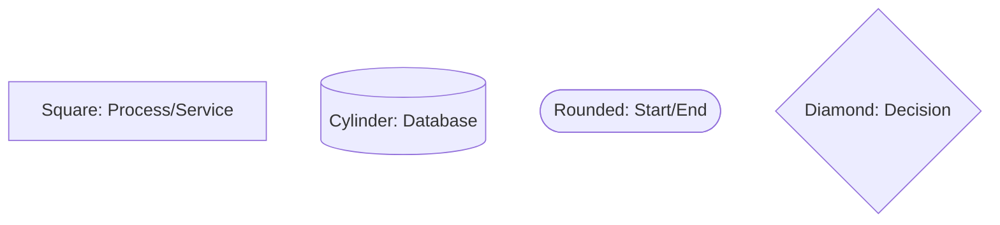

### 3. Clear Labels

Use descriptive, unambiguous labels:

```mermaid
✅ Good
graph LR
    A[User submits form] --> B[Validate input]
    B --> C[Save to database]

❌ Bad
graph LR
    A[Start] --> B[Process]
    B --> C[End]
```

### 4. Logical Flow

- **Top to bottom** or **Left to right** (reading direction)
- **Start to finish** follows natural sequence
- **Group related** elements together

### 5. Appropriate Detail Level

Match detail to audience:

**High-level (executives):**
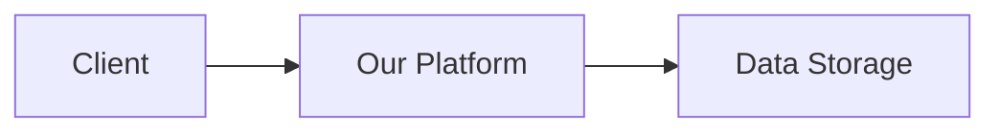

**Mid-level (engineers):**
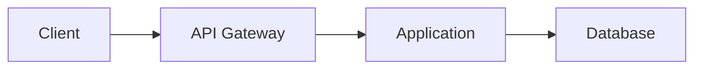

**Detailed (architects):**
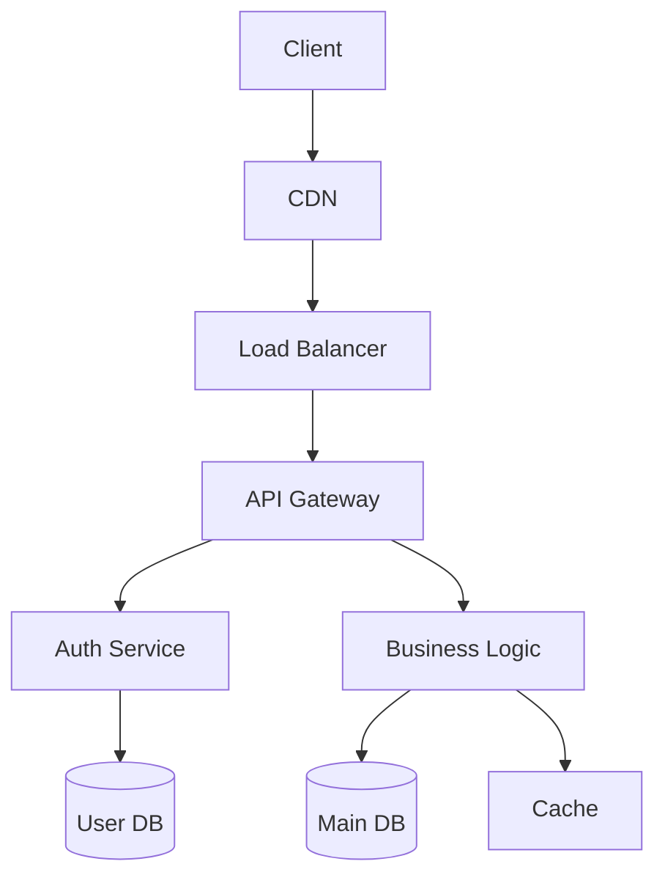

## Diagram Types

### 1. Architecture Diagrams

Show system components and their relationships.

**Best Practices:**
- Use standard shapes (rectangles for services, cylinders for databases)
- Show external services clearly
- Indicate communication protocols
- Group by layer or domain

**Example:**

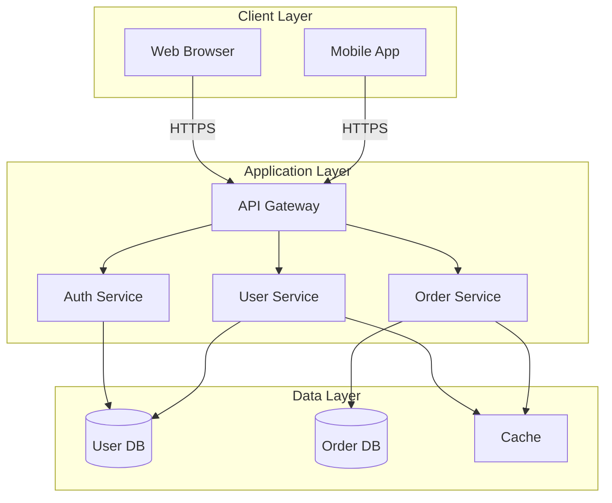

### 2. Sequence Diagrams

Show interactions over time.

**Best Practices:**
- Time flows top to bottom
- Show participant lifelines
- Include return messages
- Add notes for clarity
- Limit to critical interactions

**Example:**

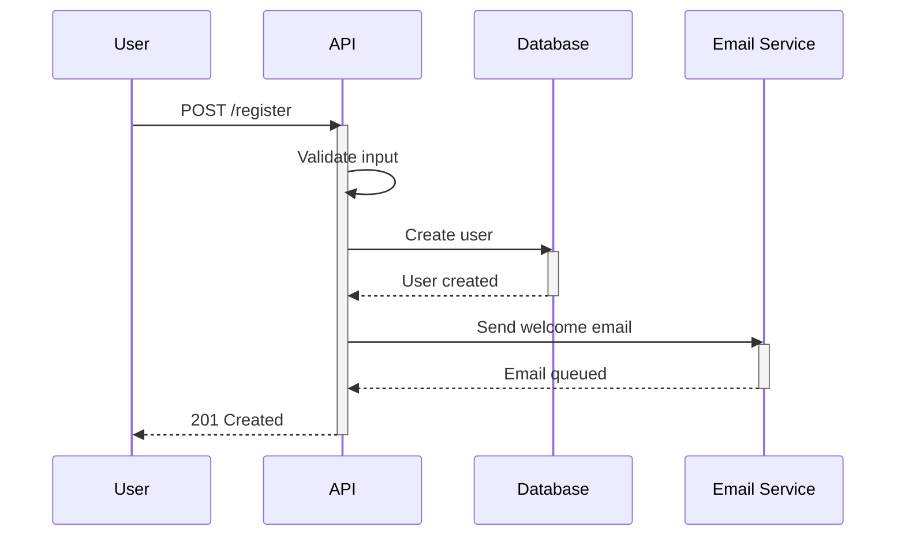

### 3. Flowcharts

Show decision logic and process flow.

**Best Practices:**
- One start, one or more ends
- Clear decision points
- All paths resolve
- No orphaned nodes

**Example:**

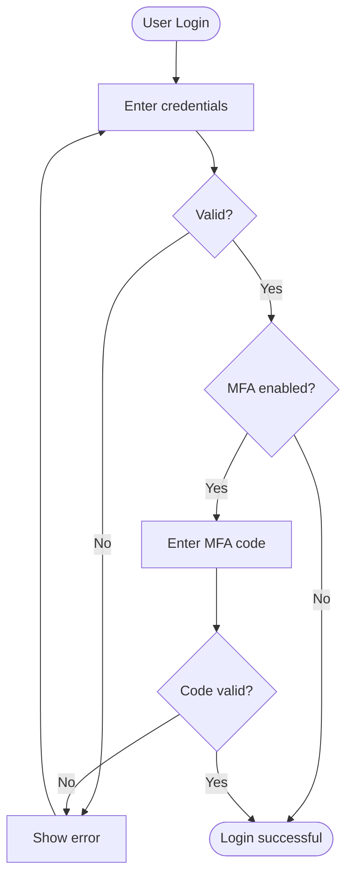

### 4. Entity Relationship Diagrams

Show database schema and relationships.

**Best Practices:**
- Show primary keys
- Indicate foreign keys
- Mark cardinality (1:1, 1:N, N:N)
- Include important fields only

**Example:**

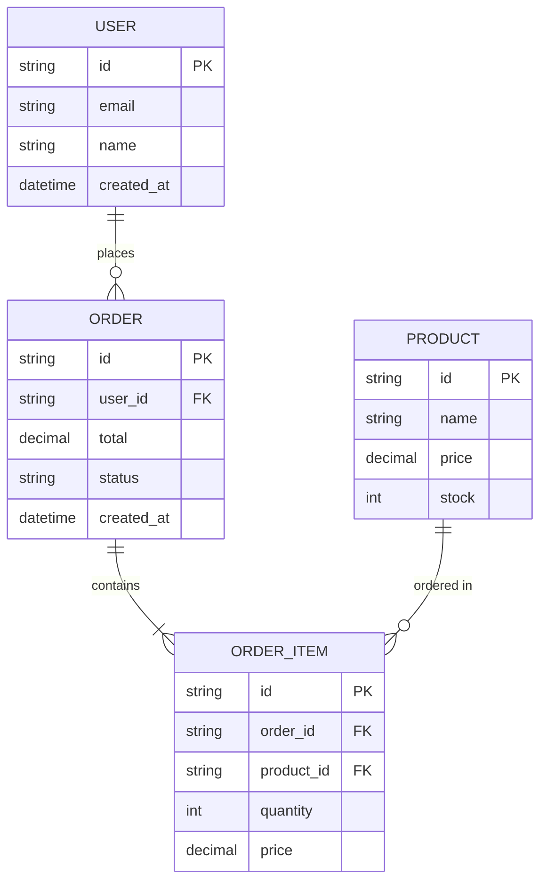

### 5. State Diagrams

Show state transitions.

**Best Practices:**
- Clear initial state
- All transitions labeled
- Final states marked
- Invalid transitions omitted

**Example:**

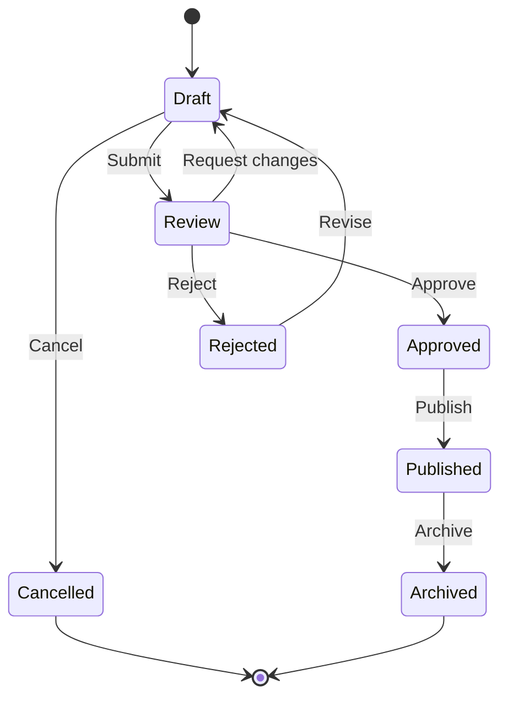

### 6. Component Diagrams

Show component structure and dependencies.

**Example:**

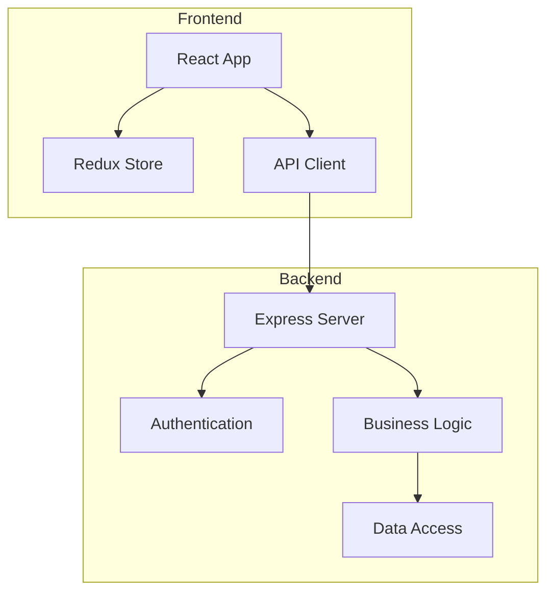

## Mermaid Syntax Guide

### Basic Syntax

**Graph/Flowchart:**
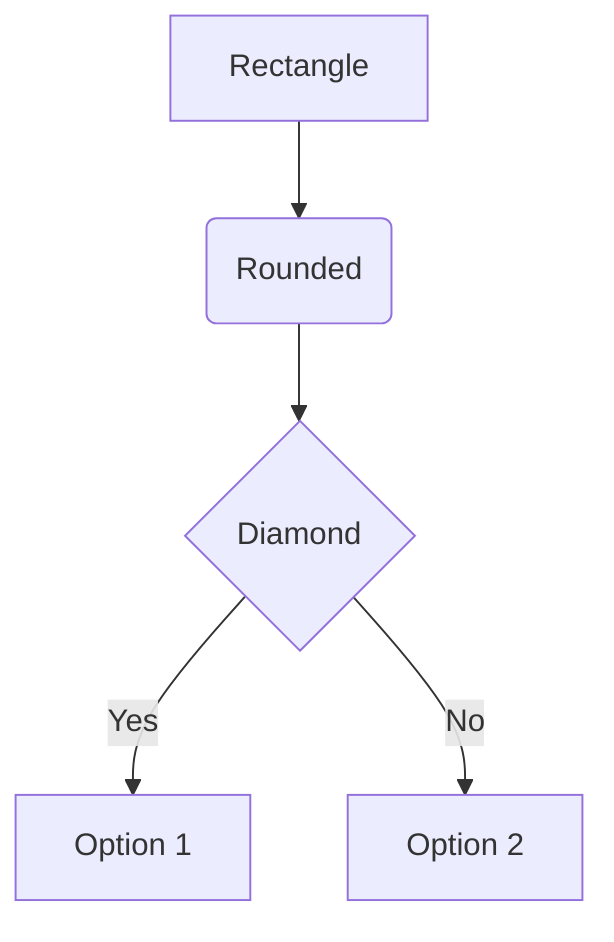

**Sequence:**
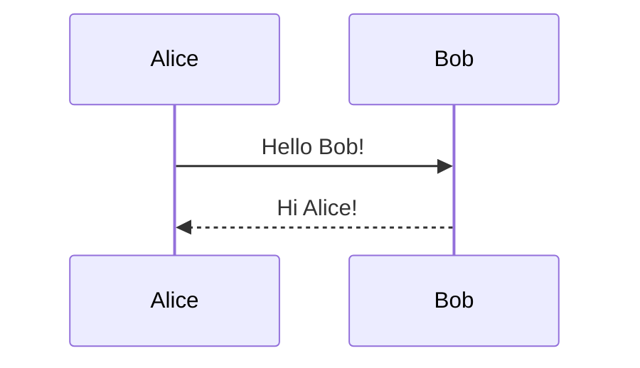

**Class:**
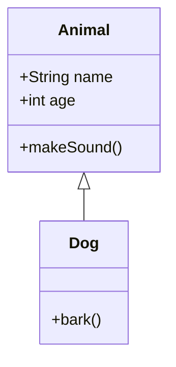

**State:**
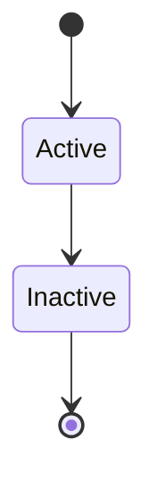

**ER Diagram:**
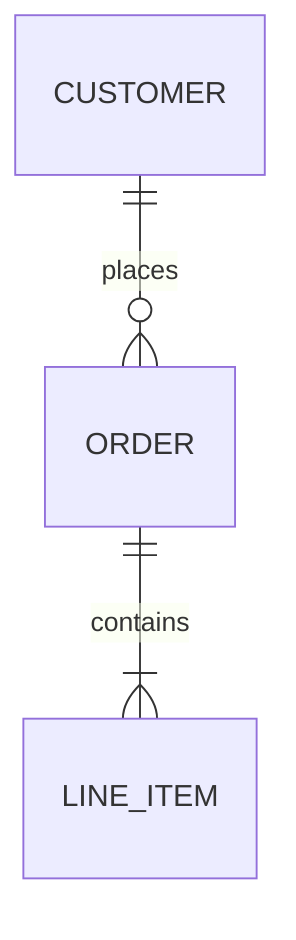

### Node Shapes

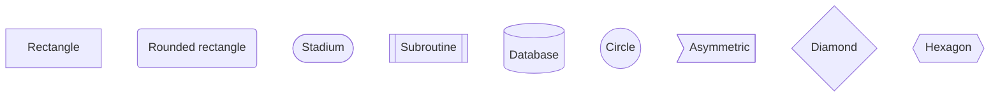

### Arrow Types

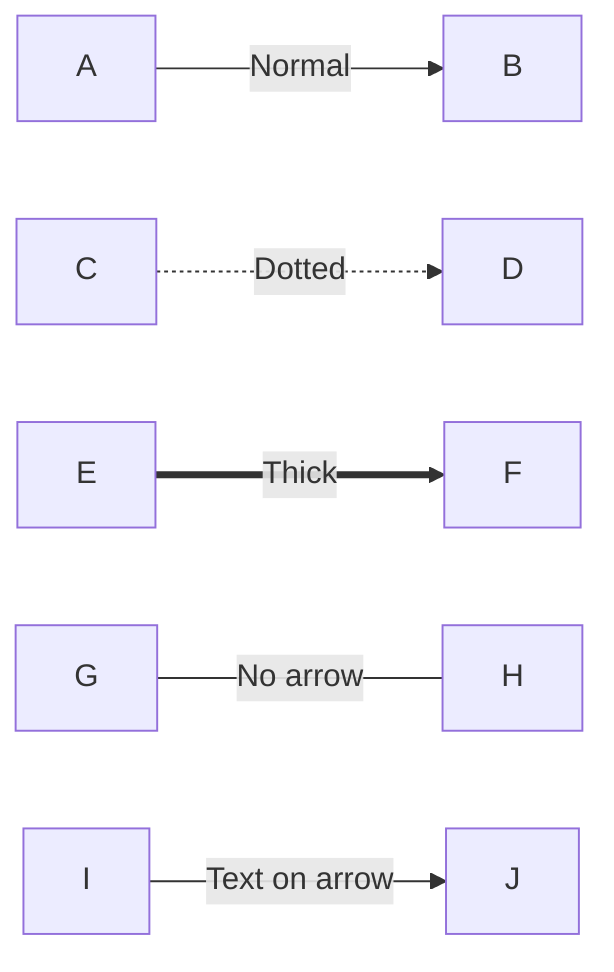

### Subgraphs

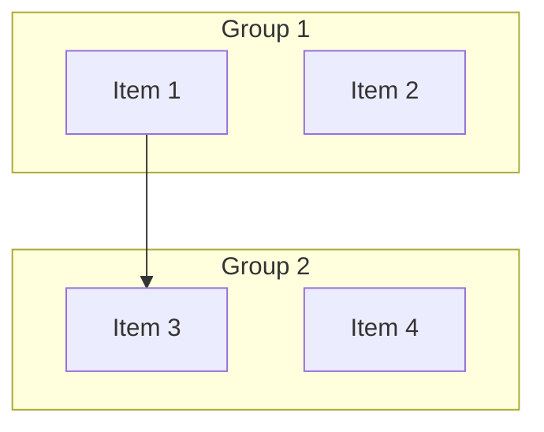

## Style Guidelines

### Colors and Styling

**Use color sparingly:**
- Highlight important paths
- Distinguish layers
- Show status (success/error)
- Group related items

**Mermaid styling:**

```mermaid
graph LR
    A[Normal]
    B[Highlighted]
    C[Error]

    style B fill:#90EE90
    style C fill:#FFB6C6
```

### Text Formatting

**Keep labels concise:**
- ✅ "Validate user input"
- ❌ "Validates all the user input data including email, password, and other profile information"

**Use consistent terminology:**
- Pick one term (e.g., "user" not alternating with "customer")
- Match code/API naming

**Capitalization:**
- Sentence case for labels: "Process payment"
- Title Case for components: "Payment Service"

## Common Patterns

### 1. Three-Tier Architecture

```mermaid
graph TB
    subgraph Presentation
        A[Web UI]
        B[Mobile App]
    end
    subgraph Application
        C[API Gateway]
        D[Business Logic]
    end
    subgraph Data
        E[(Database)]
        F[Cache]
    end
    A --> C
    B --> C
    C --> D
    D --> E
    D --> F
```

### 2. Microservices

```mermaid
graph TB
    A[API Gateway] --> B[Auth Service]
    A --> C[User Service]
    A --> D[Order Service]
    A --> E[Payment Service]

    C --> F[(User DB)]
    D --> G[(Order DB)]
    E --> H[(Payment DB)]

    C -.->|Events| I[Message Queue]
    D -.->|Events| I
    E -.->|Events| I
```

### 3. Request/Response Flow

```mermaid
sequenceDiagram
    participant C as Client
    participant A as API
    participant D as Database

    C->>+A: Request
    A->>A: Validate
    A->>+D: Query
    D-->>-A: Results
    A->>A: Transform
    A-->>-C: Response
```

### 4. Error Handling Flow

```mermaid
flowchart TD
    A[Receive Request] --> B{Valid?}
    B -->|No| C[Return 400]
    B -->|Yes| D[Process]
    D --> E{Success?}
    E -->|No| F{Retryable?}
    F -->|Yes| G[Retry with backoff]
    G --> D
    F -->|No| H[Return 500]
    E -->|Yes| I[Return 200]
```

## Accessibility

### Make Diagrams Accessible

1. **Provide alt text:**
   ```markdown
   
   ```

2. **Describe in text:**
   ```markdown
   The system consists of three layers:
   1. Client layer (web and mobile apps)
   2. Application layer (API and business logic)
   3. Data layer (database and cache)
   ```

3. **Use sufficient contrast:**
   - Avoid low-contrast color combinations
   - Test with colorblindness simulators

4. **Don't rely solely on color:**
   - Use shapes, patterns, or labels
   - Add text labels to differentiate

5. **Keep text readable:**
   - Minimum 12pt font size
   - Clear, simple fonts
   - Good contrast with background

## Tools and Resources

### Diagramming Tools

**Code-based (version control friendly):**
- **Mermaid** - Markdown-native, simple syntax
- **PlantUML** - Powerful, many diagram types
- **Graphviz** - Low-level, precise control
- **D2** - Modern, declarative

**Visual editors:**
- **draw.io** - Free, feature-rich
- **Lucidchart** - Collaborative
- **Excalidraw** - Hand-drawn style
- **Miro** - Whiteboarding
- **Figma** - Design-focused

**Specialized:**
- **dbdiagram.io** - Database schemas
- **Structurizr** - C4 model diagrams
- **Cloudcraft** - AWS architecture

### Mermaid Resources

- [Mermaid Live Editor](https://mermaid.live) - Test diagrams
- [Mermaid Documentation](https://mermaid.js.org)
- [GitHub Mermaid Support](https://github.blog/2022-02-14-include-diagrams-markdown-files-mermaid/)

### Best Practice Examples

- [C4 Model](https://c4model.com/) - Software architecture diagrams
- [AWS Architecture Icons](https://aws.amazon.com/architecture/icons/)
- [Azure Architecture Center](https://docs.microsoft.com/azure/architecture/)
- [Google Cloud Architecture](https://cloud.google.com/architecture)

## Diagram Checklist

Before publishing a diagram:

- [ ] Purpose is clear
- [ ] Appropriate diagram type chosen
- [ ] Fewer than 9 main elements
- [ ] Labels are clear and concise
- [ ] Flow direction is logical
- [ ] Consistent notation used
- [ ] Color used purposefully
- [ ] Text description provided
- [ ] Accessible to colorblind users
- [ ] Up-to-date with current system
- [ ] Source code version controlled
- [ ] Renders correctly in documentation

## Examples Gallery

### Simple API Flow

```mermaid
sequenceDiagram
    User->>API: GET /users/123
    API->>Database: SELECT * FROM users WHERE id=123
    Database-->>API: User data
    API-->>User: 200 OK + JSON
```

### Authentication Flow

```mermaid
sequenceDiagram
    participant U as User
    participant C as Client
    participant A as Auth Server
    participant R as Resource Server

    U->>C: Login
    C->>A: POST /auth/login
    A-->>C: Access token + Refresh token
    C->>R: GET /api/resource (with token)
    R->>R: Validate token
    R-->>C: Protected resource
    C-->>U: Display data
```

### CI/CD Pipeline

```mermaid
flowchart LR
    A[Code Push] --> B[Run Tests]
    B --> C{Tests Pass?}
    C -->|No| D[Notify Developer]
    C -->|Yes| E[Build Image]
    E --> F[Push to Registry]
    F --> G{Branch?}
    G -->|main| H[Deploy to Production]
    G -->|develop| I[Deploy to Staging]
```

---

**See Also:**
- [Documentation Standards](./documentation_standards.md)
- [API Documentation Guide](./api_documentation_guide.md)