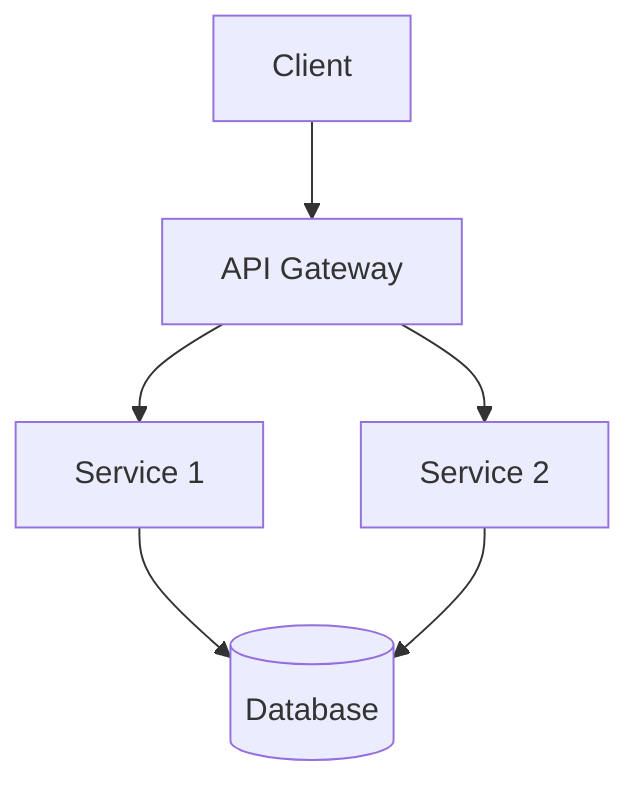
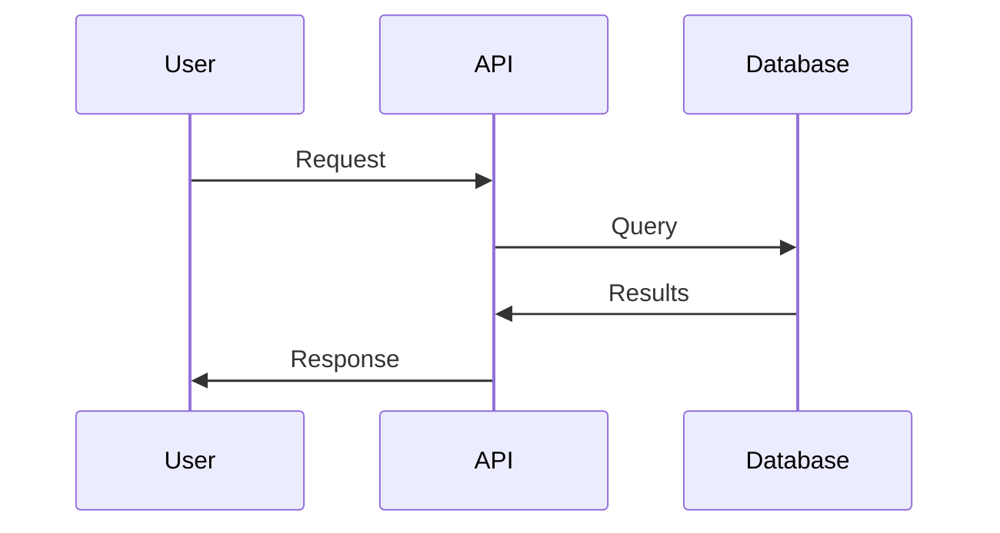

# Documentation Standards

Comprehensive guidelines for creating high-quality, consistent documentation.

## General Principles

1. **Clarity First** - Write for your audience, not for yourself
2. **Show, Don't Tell** - Include working examples
3. **Progressive Disclosure** - Start simple, add complexity gradually
4. **Consistency** - Use consistent terminology and formatting
5. **Maintainability** - Keep docs close to code

## Formatting Guidelines

### Headers

Use ATX-style headers (# symbols) with a single space:

```markdown
# Top Level (Page Title)
## Second Level (Major Sections)
### Third Level (Subsections)
#### Fourth Level (Minor Subsections)
```

**Rules:**
- Only one H1 per document
- Don't skip header levels
- Add blank line before and after headers

### Code Blocks

Always specify the language for syntax highlighting:

```markdown
```python
def hello():
    return "Hello, World!"
```
```

**Supported languages:** python, javascript, typescript, bash, json, yaml, sql, html, css

### Lists

**Unordered lists:**
```markdown
- Item one
- Item two
  - Nested item
  - Another nested item
- Item three
```

**Ordered lists:**
```markdown
1. First step
2. Second step
3. Third step
```

**Task lists:**
```markdown
- [x] Completed task
- [ ] Pending task
- [ ] Another pending task
```

### Links

**Inline links:**
```markdown
[Link text](https://example.com)
```

**Reference links:**
```markdown
See the [API reference][api-ref] for details.

[api-ref]: https://api.example.com/docs
```

### Tables

```markdown
| Column 1 | Column 2 | Column 3 |
|----------|----------|----------|
| Data 1   | Data 2   | Data 3   |
| Data 4   | Data 5   | Data 6   |
```

**Guidelines:**
- Keep tables simple (max 5 columns)
- For complex data, use code blocks or separate pages
- Ensure proper alignment

## Writing Style

### Voice and Tone

- **Use active voice** - "The function returns..." not "The value is returned by..."
- **Use second person** - "You can configure..." not "Users can configure..."
- **Be concise** - Remove unnecessary words
- **Be specific** - "Set timeout to 30 seconds" not "Set an appropriate timeout"

### Examples

**Good:**
```markdown
To configure the API timeout, set the `timeout` parameter to the number of seconds:

```python
client = APIClient(timeout=30)
```

This sets a 30-second timeout for all requests.
```

**Bad:**
```markdown
Users might want to configure various timeout settings depending on their use case and requirements...
```

### Terminology

**Be consistent:**
- Choose one term and stick with it
- Don't alternate between "function", "method", and "procedure"
- Create a glossary for ambiguous terms

**Avoid jargon:**
- Define technical terms on first use
- Link to glossary or external resources
- Consider your audience's knowledge level

## Code Examples

### Quality Standards

All code examples must:

1. **Work correctly** - Test before publishing
2. **Be complete** - Include imports and setup
3. **Be realistic** - Use real-world scenarios
4. **Be safe** - No hardcoded credentials or unsafe practices
5. **Be formatted** - Follow language style guides

### Example Structure

```markdown
### Task Name

Brief description of what this example demonstrates.

**Prerequisites:**
- Requirement 1
- Requirement 2

**Code:**
```python
# Complete, working example
import requests

def fetch_data(api_key):
    response = requests.get(
        "https://api.example.com/data",
        headers={"Authorization": f"Bearer {api_key}"}
    )
    return response.json()

# Usage
data = fetch_data("your-api-key")
print(data)
```

**Expected output:**
```json
{
  "status": "success",
  "data": "[...]"
}
```

**Explanation:**
1. Import the required library
2. Define function with API key parameter
3. Make authenticated request
4. Return parsed JSON response
```

## API Documentation

### Function/Method Documentation

```markdown
### `function_name(param1, param2=default)`

Brief one-line description.

**Parameters:**
- `param1` (type, required): Description of parameter 1
- `param2` (type, optional): Description of parameter 2. Default: `default`

**Returns:**
- `return_type`: Description of return value

**Raises:**
- `ErrorType`: When this error occurs

**Example:**
```python
result = function_name("value1", param2="value2")
```
```

### Endpoint Documentation

```markdown
### `GET /api/endpoint`

Brief description of what this endpoint does.

**Authentication:** Required (Bearer token)

**Parameters:**

Query parameters:
- `id` (string, required): Resource identifier
- `filter` (string, optional): Filter criteria

**Request:**
```bash
curl -X GET "https://api.example.com/endpoint?id=123" \
  -H "Authorization: Bearer YOUR_TOKEN"
```

**Response (200 OK):**
```json
{
  "status": "success",
  "data": {
    "id": "123",
    "name": "Example"
  }
}
```

**Response (404 Not Found):**
```json
{
  "status": "error",
  "message": "Resource not found"
}
```

**Error Codes:**
- `400`: Bad request - Invalid parameters
- `401`: Unauthorized - Invalid or missing token
- `404`: Not found - Resource doesn't exist
- `500`: Internal server error
```

## Diagrams

### When to Use Diagrams

Use diagrams for:
- System architecture
- Data flow
- Sequence diagrams
- State machines
- Entity relationships

### Mermaid Diagrams

Prefer Mermaid for diagrams (renders in markdown):

**Architecture:**


**Sequence:**


### Diagram Best Practices

- Keep it simple - max 10 nodes
- Use clear labels
- Include a legend if needed
- Provide text description for accessibility
- Update when system changes

## Documentation Organization

### File Structure

```
docs/
├── README.md           # Start here
├── getting-started/
│   ├── installation.md
│   ├── quickstart.md
│   └── configuration.md
├── guides/
│   ├── authentication.md
│   ├── error-handling.md
│   └── best-practices.md
├── api/
│   ├── reference.md
│   └── examples.md
└── contributing/
    ├── guidelines.md
    └── style-guide.md
```

### README Structure

Every README should include:

1. **Title and description**
2. **Quick start** (< 5 minutes to first success)
3. **Installation instructions**
4. **Basic usage example**
5. **Links to full documentation**
6. **Contributing guidelines**
7. **License information**

## Common Patterns

### Quick Start Guide

```markdown
# Quick Start

Get up and running in 5 minutes!

## 1. Install
```bash
npm install package-name
```

## 2. Configure
```javascript
const client = new Client({ apiKey: 'YOUR_KEY' });
```

## 3. Use
```javascript
const result = await client.getData();
console.log(result);
```

That's it! See the [full guide](./guide.md) for more details.
```

### Troubleshooting Section

```markdown
## Troubleshooting

### Problem: Error message appears

**Cause:** Brief explanation of why this happens

**Solution:**
1. Step to fix
2. Another step
3. Verify it's fixed

**Still having issues?** [Open an issue](link) or ask on [forum](link).
```

## Version Control

### Changelog

Maintain a CHANGELOG.md with:

```markdown
# Changelog

## [Unreleased]
### Added
- New feature

### Changed
- Modified behavior

### Deprecated
- Will be removed in next version

### Removed
- Deleted feature

### Fixed
- Bug fix

### Security
- Security fix

## [1.0.0] - 2024-01-15
### Added
- Initial release
```

### Version Numbers in Docs

- Always specify which version docs apply to
- Maintain docs for multiple versions if needed
- Archive old versions but keep accessible

## Testing Documentation

### Manual Testing

Before publishing:

- [ ] All links work
- [ ] All code examples run successfully
- [ ] Images and diagrams display correctly
- [ ] Formatting is correct
- [ ] Spelling and grammar checked

### Automated Testing

Consider tools that:
- Extract and run code examples
- Check for broken links
- Validate markdown syntax
- Enforce style guidelines

## Accessibility

### Screen Reader Friendly

- Use proper heading hierarchy
- Provide alt text for images
- Describe diagrams in text
- Use semantic HTML when needed

### Color and Contrast

- Don't rely solely on color
- Use sufficient contrast
- Test with color blindness simulators

## Internationalization

If supporting multiple languages:

- Keep English as source
- Translate key docs first (README, Getting Started)
- Use i18n-friendly structure
- Avoid idioms and cultural references
- Date formats: Use ISO 8601 (YYYY-MM-DD)

## Maintenance

### Regular Reviews

- Quarterly review of all docs
- Update for new features
- Remove deprecated content
- Check and fix broken links
- Update screenshots and examples

### Community Contributions

- Welcome doc improvements
- Provide clear contribution guidelines
- Review and merge promptly
- Thank contributors

## Tools and Resources

### Markdown Editors

- VS Code with markdown extensions
- Obsidian
- Typora
- HackMD

### Linters and Validators

- markdownlint
- vale (prose linter)
- linkchecker

### Generators

- Sphinx (Python)
- JSDoc (JavaScript)
- Doxygen (multiple languages)
- Docusaurus (documentation sites)
