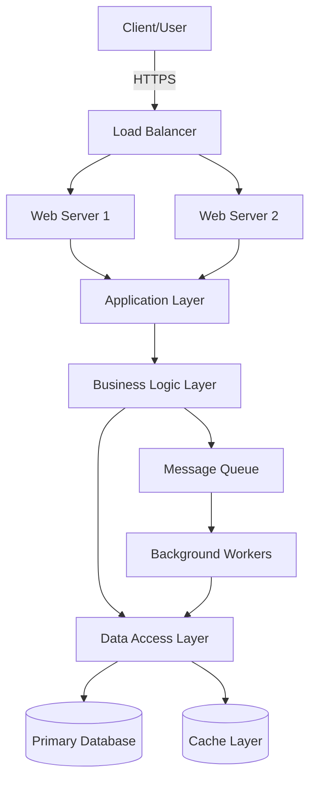
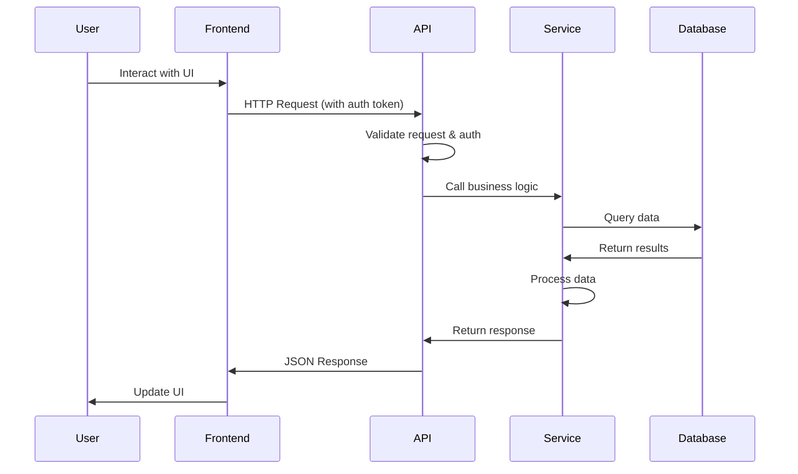
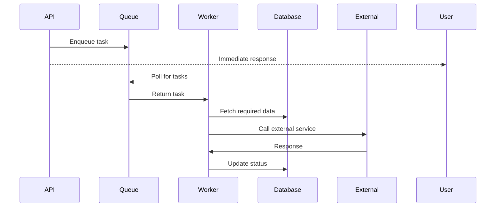
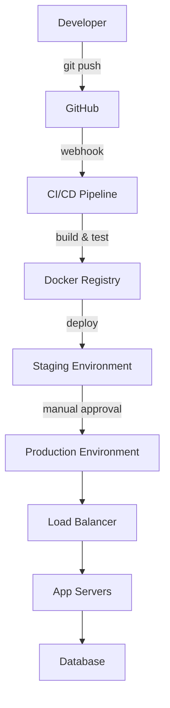

# System Architecture

*Project Name - Architecture Documentation*

## Overview

Brief high-level description of the system architecture. Explain the overall design philosophy and main architectural pattern (e.g., microservices, monolith, event-driven, etc.).

**Last Updated:** YYYY-MM-DD
**Version:** 1.0.0

## Architecture Diagram

### Architecture Style

- **Pattern:** [Monolithic / Microservices / Serverless / etc.]
- **Communication:** [REST / GraphQL / gRPC / Event-driven]
- **Deployment:** [Container-based / Serverless / Traditional]

## System Components

### 1. Frontend / Client Layer

**Purpose:** User interface and client-side logic

**Technologies:**
- Framework: [React / Vue / Angular / etc.]
- State Management: [Redux / Vuex / etc.]
- Styling: [CSS / Tailwind / Material-UI]

**Key Responsibilities:**
- Render user interface
- Handle user interactions
- Validate client-side input
- Communicate with backend APIs

**Location:** `/frontend` or `/client`

---

### 2. API Gateway / Load Balancer

**Purpose:** Entry point for all client requests, handles routing and load distribution

**Technologies:**
- [NGINX / AWS ALB / Kong / etc.]

**Key Responsibilities:**
- Route requests to appropriate services
- SSL/TLS termination
- Rate limiting
- Request authentication
- Load balancing

**Configuration:** `/config/nginx.conf` or cloud provider settings

---

### 3. Application/API Layer

**Purpose:** Handle HTTP requests and route to business logic

**Technologies:**
- Framework: [Express.js / Flask / Django / Spring Boot]
- Language: [JavaScript / Python / Java]

**Key Responsibilities:**
- Handle HTTP requests/responses
- Request validation
- Authentication & Authorization
- Error handling
- API versioning

**Location:** `/src/api` or `/src/routes`

**Key Files:**
- `api/routes.py` - Route definitions
- `api/middleware.py` - Middleware functions
- `api/validators.py` - Request validation

---

### 4. Business Logic Layer

**Purpose:** Core application logic and business rules

**Technologies:**
- Language: [Python / Java / Node.js]
- Frameworks: [None / Domain-specific]

**Key Responsibilities:**
- Implement business rules
- Process data
- Coordinate between services
- Execute workflows

**Location:** `/src/services` or `/src/business`

**Key Components:**
- `services/user_service.py` - User management
- `services/order_service.py` - Order processing
- `services/payment_service.py` - Payment handling

---

### 5. Data Access Layer

**Purpose:** Abstract database operations and data persistence

**Technologies:**
- ORM: [SQLAlchemy / Sequelize / Hibernate]
- Query Builder: [If applicable]

**Key Responsibilities:**
- Database queries
- Data validation
- Transaction management
- Data mapping (ORM)

**Location:** `/src/models` or `/src/data`

**Key Files:**
- `models/user.py` - User model
- `models/order.py` - Order model
- `repositories/base_repository.py` - Base repository pattern

---

### 6. Database Layer

**Purpose:** Persistent data storage

**Technologies:**
- **Primary Database:** [PostgreSQL / MySQL / MongoDB]
  - Version: X.X
  - Purpose: Main data storage
  - Location: [Cloud provider / Self-hosted]

- **Cache Layer:** [Redis / Memcached]
  - Purpose: Session storage, caching
  - TTL: Varies by use case

- **Search Engine:** [Elasticsearch / Algolia] (if applicable)
  - Purpose: Full-text search

**Database Schema:** See [Database Documentation](./database.md)

---

### 7. Message Queue / Event Bus

**Purpose:** Asynchronous task processing and inter-service communication

**Technologies:**
- Queue: [RabbitMQ / Redis Queue / AWS SQS]
- Message Format: JSON

**Key Responsibilities:**
- Decouple components
- Handle asynchronous tasks
- Event distribution
- Retry failed tasks

**Queues:**
- `email-queue` - Email notifications
- `data-processing-queue` - Heavy computations
- `webhook-queue` - External webhook calls

---

### 8. Background Workers

**Purpose:** Process asynchronous tasks from message queues

**Technologies:**
- Worker Framework: [Celery / Bull / Sidekiq]

**Key Responsibilities:**
- Process queued jobs
- Send emails
- Generate reports
- Data synchronization

**Location:** `/src/workers`

---

### 9. External Services

**Purpose:** Third-party integrations

**Integrations:**
- **Payment Processing:** [Stripe / PayPal]
- **Email Service:** [SendGrid / AWS SES]
- **Storage:** [AWS S3 / Google Cloud Storage]
- **Authentication:** [Auth0 / Firebase Auth]
- **Analytics:** [Google Analytics / Mixpanel]

## Data Flow

### 1. User Request Flow

### 2. Background Task Flow

## Technology Stack

### Backend
- **Language:** Python 3.11
- **Framework:** Flask 2.3.0
- **ORM:** SQLAlchemy 2.0
- **Task Queue:** Celery 5.3
- **API Documentation:** OpenAPI 3.0

### Frontend
- **Framework:** React 18
- **Build Tool:** Vite
- **State Management:** Redux Toolkit
- **UI Library:** Material-UI

### Infrastructure
- **Database:** PostgreSQL 15
- **Cache:** Redis 7
- **Message Queue:** RabbitMQ 3.12
- **Web Server:** NGINX
- **Container:** Docker
- **Orchestration:** Kubernetes (if applicable)

### DevOps
- **CI/CD:** GitHub Actions
- **Monitoring:** Prometheus + Grafana
- **Logging:** ELK Stack (Elasticsearch, Logstash, Kibana)
- **Error Tracking:** Sentry

## Security Architecture

### Authentication
- **Method:** JWT (JSON Web Tokens)
- **Token Storage:** HTTP-only cookies
- **Token Expiry:** 1 hour (access), 7 days (refresh)

### Authorization
- **Model:** Role-Based Access Control (RBAC)
- **Roles:** Admin, User, Guest
- **Permissions:** Defined per resource

### Data Security
- **Encryption at Rest:** AES-256
- **Encryption in Transit:** TLS 1.3
- **Secrets Management:** [AWS Secrets Manager / HashiCorp Vault]
- **Password Hashing:** bcrypt (cost factor: 12)

### API Security
- **Rate Limiting:** 1000 requests/hour per user
- **CORS:** Configured for specific origins
- **Input Validation:** All inputs validated
- **SQL Injection Protection:** Parameterized queries (ORM)

## Scalability & Performance

### Horizontal Scaling
- **Web Servers:** Auto-scaling group (2-10 instances)
- **Workers:** Can scale based on queue depth
- **Database:** Read replicas for scaling reads

### Caching Strategy
- **Layer 1:** Browser cache (static assets)
- **Layer 2:** CDN cache (global distribution)
- **Layer 3:** Application cache (Redis)
- **Layer 4:** Database query cache

### Performance Targets
- **API Response Time:** < 200ms (p95)
- **Page Load Time:** < 2s (p95)
- **Database Query Time:** < 50ms (p95)
- **Uptime:** 99.9%

## Deployment Architecture

### Environments

| Environment | Purpose | URL | Database |
|-------------|---------|-----|----------|
| Development | Local development | localhost:3000 | Local DB |
| Staging | Pre-production testing | staging.example.com | Staging DB |
| Production | Live environment | www.example.com | Production DB |

## Disaster Recovery

### Backup Strategy
- **Database Backups:** Daily full backup, hourly incremental
- **Retention:** 30 days
- **Recovery Time Objective (RTO):** 1 hour
- **Recovery Point Objective (RPO):** 1 hour

### High Availability
- **Multi-AZ Deployment:** Yes
- **Failover Strategy:** Automatic
- **Database Replication:** Primary + 2 replicas

## Monitoring & Observability

### Metrics
- System metrics (CPU, memory, disk)
- Application metrics (request rate, error rate, latency)
- Business metrics (user signups, transactions)

### Logging
- **Centralized Logging:** ELK Stack
- **Log Levels:** DEBUG, INFO, WARNING, ERROR, CRITICAL
- **Retention:** 90 days

### Alerting
- **On-Call Rotation:** PagerDuty
- **Alert Channels:** Email, Slack, SMS
- **Critical Alerts:**
  - API error rate > 1%
  - Database connection failures
  - Disk usage > 85%

## Architecture Decisions

### ADR-001: Choice of Monolith vs Microservices
- **Date:** 2024-01-15
- **Status:** Accepted
- **Decision:** Start with modular monolith
- **Rationale:** Team size and complexity don't justify microservices overhead yet
- **Consequences:** Can extract services later if needed

### ADR-002: Database Choice
- **Date:** 2024-01-20
- **Status:** Accepted
- **Decision:** PostgreSQL as primary database
- **Rationale:** ACID compliance, JSON support, mature ecosystem
- **Consequences:** Strong consistency, but requires vertical scaling for very high loads

### ADR-003: Authentication Strategy
- **Date:** 2024-01-25
- **Status:** Accepted
- **Decision:** JWT-based authentication
- **Rationale:** Stateless, scalable, standard
- **Consequences:** Token revocation requires additional mechanism

## Known Limitations

1. **Single Database:** No sharding yet, may limit horizontal scalability
2. **Synchronous API:** Some operations could benefit from async processing
3. **File Storage:** Local storage not suitable for multi-instance deployments

## Future Improvements

- [ ] Implement database sharding for scalability
- [ ] Add GraphQL API alongside REST
- [ ] Implement event sourcing for critical workflows
- [ ] Add real-time features with WebSockets
- [ ] Migrate to microservices architecture (if needed)

## References

- [API Documentation](./api/reference.md)
- [Database Schema](./database.md)
- [Deployment Guide](./deployment.md)
- [Security Guidelines](./security.md)

---

**Questions?** Contact the architecture team at architecture@example.com